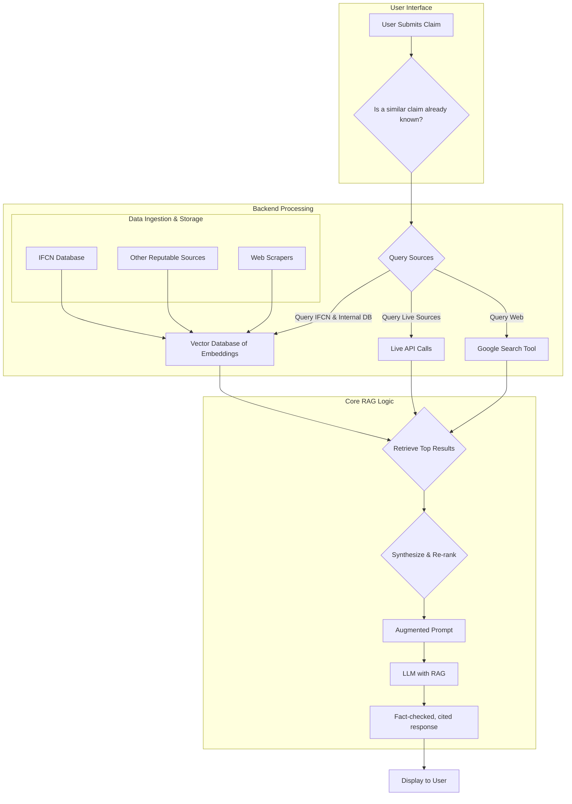

# Fact-Checking Workflow for a WhatsApp Bot
Building a bot capable of verifying information requires a layered and strategic approach. The core functionality can be broken down into a series of steps, with different tools and techniques applied depending on the type of information received.

### The Core Workflow
A verification process typically follows this logical flow:
1. Receive User Input: 
The bot receives a message, which could be text, an image, a video, or a link.

2. Input Classification: 
The system identifies the type of content it needs to verify.

3. Apply Verification Logic: 
Based on the content type, the bot routes the request to the appropriate verification module.

4. Generate a Response: 
The bot compiles the results into a clear, concise, and sourced response for the user, indicating whether the claim is true, false, or unverified.

### Verifying Text-Based Claims
This is the most common form of misinformation. The process relies heavily on automated data retrieval and analysis.

1. Natural Language Processing (NLP) and Claim Extraction:\
The first step is to use NLP to analyze the user's text. The goal is to identify the central claim or factual assertion that needs to be verified. For example, if the user sends "Did scientists discover a cure for the common cold?", the NLP model would extract the core claim: "Scientists discovered a cure for the common cold." This process can be mathematically modeled using tokenization and part-of-speech tagging. For a given sentence S=w1​,w2​,...,wn​, we can represent it as a vector in a high-dimensional space where its location is determined by its meaning.

2. Database and API Lookups: 
Once the claim is extracted, the bot queries reliable, pre-existing fact-checking databases. Key sources include:

3. International Fact-Checking Network (IFCN) Database: 
A massive, searchable repository of fact-checks from around the world.

4. Reputable Fact-Checking Organizations: 
APIs from organizations like PolitiFact, Snopes, or local fact-checkers.

5. Search Grounding: 
Using a large language model with search grounding allows the bot to perform real-time searches on the open web and use the search results to formulate a grounded response, complete with citations.

6. Cross-Referencing:
The bot compares the extracted claim to the results from its database and API lookups. It looks for a direct match, or a claim that has been widely debunked or verified by multiple sources.

### Verifying Images and Videos
Visual content is often used to spread misinformation, especially when taken out of context.

1. Reverse Image Search:\
The bot sends the image to a reverse image search engine's API. The goal is to find where else the image has appeared online. If the image is widely used in a different context or appears on a known fact-checking site, it's a strong indicator of a misleading claim.

2. Metadata Analysis:\
Images and videos can contain hidden data called EXIF (Exchangeable Image File Format) data. This can reveal the device that took the photo, the date and time, and even GPS coordinates. Inconsistencies in this data can flag the content as suspicious.

3. Deepfake Detection:\
This is a highly advanced and rapidly evolving field. Automated deepfake detection tools analyze visual inconsistencies that are difficult for the human eye to see, such as:
- Unnatural eye blinking patterns.
- Inconsistent shadows or lighting on the face.
- Subtle pixel-level artifacts around the edges of a swapped face.

### Analyzing Links and URLs
Many messages contain links to misleading websites or articles.

1. Domain Reputation Check:\
The bot checks the domain against a list of known malicious or low-reputation sites. This is a quick way to block spam or phishing attempts.

2. Content Extraction and Keyword Analysis:\
For more nuanced checks, the bot can scrape the content of the linked page. It then analyzes the headline and body for sensational or misleading keywords, checking if the headline accurately represents the article's content.

### The Human-in-the-Loop Model
It's crucial to understand that a fully automated system is not a perfect solution. The most effective fact-checking bots incorporate a "human-in-the-loop" model.This means that when the automated system encounters a complex, nuanced, or new claim that it cannot verify with a high degree of confidence, it flags the request for a human reviewer.The Human reviewers provide the necessary feedback and data to train and improve the AI models over time, ensuring the bot's accuracy evolves with new forms of misinformation.
